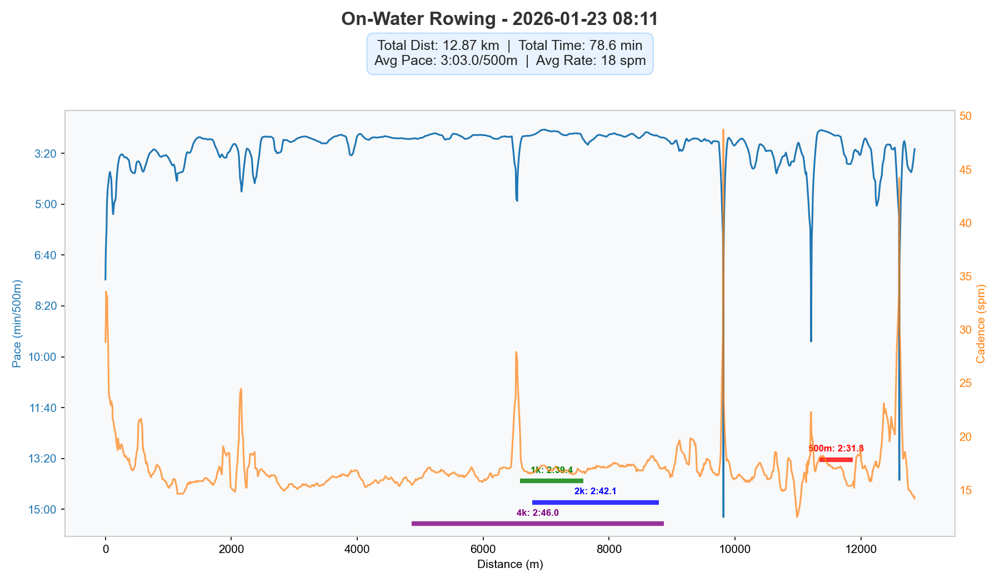

# Rowing Coach Skill 🚣‍♀️

Professional rowing coach assistant that analyzes FIT files and generates detailed training reports.

## Features

- **Multi-Source Support**: Compatible with FIT files from SpdCoach (on-water), Garmin, and Concept2 (indoor ERG).
- **Strategy C (Smart Segmentation)**: Uses 5-point smoothing and Change Point Detection (CPD) to accurately split training sessions into meaningful segments.
- **Deep Technical Analysis**:
    - **DPS (Distance Per Stroke)**: Evaluates technical efficiency against professional benchmarks.
    - **Pacing Strategy**: Identifies patterns like "Negative Splits" and power consistency.
    - **Zone Classification**: Automatically classifies training intensity (UT2, UT1, AT, TR, AN) based on Heart Rate Reserve (HRR) and stroke rate.
- **Coach Review**: Generates professional, actionable insights and technical recommendations in Chinese.
- **Visualization**: Automatically generates Pace & Cadence charts for visual review.

## Project Structure

```text
rowing-coach/
├── SKILL.md                # Skill definition for LLM
├── README.md               # This file
├── scripts/
│   └── parse_fit.py        # Core FIT parsing and analysis logic
├── references/
│   ├── coach_guidelines.md # Professional rowing coaching criteria
│   └── training_log_style.md # Markdown report template and style
└── .venv/                  # Python virtual environment (optional)
```

## Quick Start

### Installation

Requires Python 3.8+ and the following libraries:
- `fitparse`
- `matplotlib`
- `pandas`
- `geopy` (optional, for location data)

```bash
pip install fitparse matplotlib pandas geopy
```

## Usage in Antigravity Assistant

This skill is designed to work seamlessly with the **Antigravity** agentic assistant. It leverages task management and professional coaching guidelines to provide a comprehensive training review.

### 1. Interactive Analysis
Simply drag and drop your `.fit` file into the Antigravity chat and ask for an analysis:

> **User**: "分析一下这个赛艇 FIT 文件。"

Antigravity will enter **AGENTIC mode**, creating a structured task list to:
1.  **Parse**: Extract data using `parse_fit.py`.
2.  **Evaluate**: Compare your metrics (DPS, Pace, HR) against `coach_guidelines.md`.
3.  **Refine**: Generate professional Chinese feedback tailored to your performance.

### 2. Task View Visibility
During the analysis, you will see a real-time task block:

| Task Name | Status |
| :--- | :--- |
| **Extracting Rowing Data** | Running `parse_fit.py` on FIT file... |
| **Generating Coach Feedback** | Updating training report with technical review... |

### 3. Professional Output
The final result is a polished Markdown report (e.g., `ROW_YYYYMMDD_HHMM.md`) complete with data tables, pacing charts, and a **Coach Review** section.

---

## Technical CLI Usage (Advanced)
For developers or offline processing:

```bash
# Basic analysis
python3 scripts/parse_fit.py "path/to/session.fit"

# Analysis with custom HR settings
python3 scripts/parse_fit.py "session.fit" --max-hr 195 --resting-hr 60
```

## Example Analysis (Jan 23rd Session)

### Input
File: `SpdCoach 2763073 20260123 0811AM.fit`

### Analysis Results (Full Segments)
| # | Time | Distance | Pace/500m | SPM | HR | DPS | Note |
| :--- | :--- | :--- | :--- | :--- | :--- | :--- | :--- |
| 1 | 10:11 | 1479m | 3:26.4 | 18 | 104 | 8.1m | UT2 |
| 2 | 4:26 | 693m | 3:11.6 | 17 | 118 | 9.2m | UT2 |
| 3 | 24:39 | 4331m | 2:50.7 | 16 | 132 | 11.0m | UT2 |
| 4 | 18:14 | 3280m | 2:46.7 | 17 | 136 | 10.6m | UT2 |
| 5 | 8:39 | 1330m | 3:14.9 | 16 | 116 | 9.6m | UT2 |
| 6 | 1:03 | 110m | 4:43.8 | 19 | 101 | 5.6m | Rest |
| 7 | 5:07 | 913m | 2:48.1 | 17 | 122 | 10.5m | UT2 |
| 8 | 2:37 | 369m | 3:32.3 | 23 | 107 | 6.1m | UT2 |
| 9 | 0:55 | 154m | 2:58.2 | 15 | 117 | 11.2m | UT2 |

### AI Coach Feedback (Full)
> 🚀 **总体评价**: 本次训练是一次非常高质量的 UT2 技术课。主要特点是在极低频率下保持了极高的输出质量，这对建立扎实的赛艇基础至关重要。
>
> 💎 **核心亮点**:
> *   **顶级的划水实效 (DPS)**: 在第3段和第4段（总长约 7.6km）中，你的 DPS 分别达到了 **11.0m** 和 **10.6m**。在 16-17 桨频下能维持如此高的 DPS，说明你的拉桨行程非常完整，且“水感”出色。
> *   **超低频下的控制力**: 第9段虽然距离较短，但在 **15 桨频** 下做出了 **11.2m** 的 DPS。这种极低频的练习是检验身体连接（Connection）和发力节奏最好的方式。
> *   **心率区间分配**: 心率主要维持在 130bpm 左右，完美契合 UT2 训练目标，有效增强了有氧耐力基础。
>
> 💡 **技术建议**:
> *   **注意分段间的一致性**: 前两个分段（第1和第2段）的 DPS 为 **8.1m - 9.2m**，明显低于后续阶段。建议在训练起始阶段就加强对“挂水”的关注，更快地进入高效状态。
> *   **尝试微调桨频**: 既然在 16-17 频率下 DPS 已经达到甚至超过 11m，可以尝试在维持同等拉桨力度的情况下，将桨频温和地提升到 **18-19**，看看能否将配速推进到 **2:40** 以内而不损失效率。
>
> **非常棒的一堂课，这种低频大DPS的训练是通往更高级别选手的必经之路！**

### Visual Analysis (Chart)


## License
MIT
