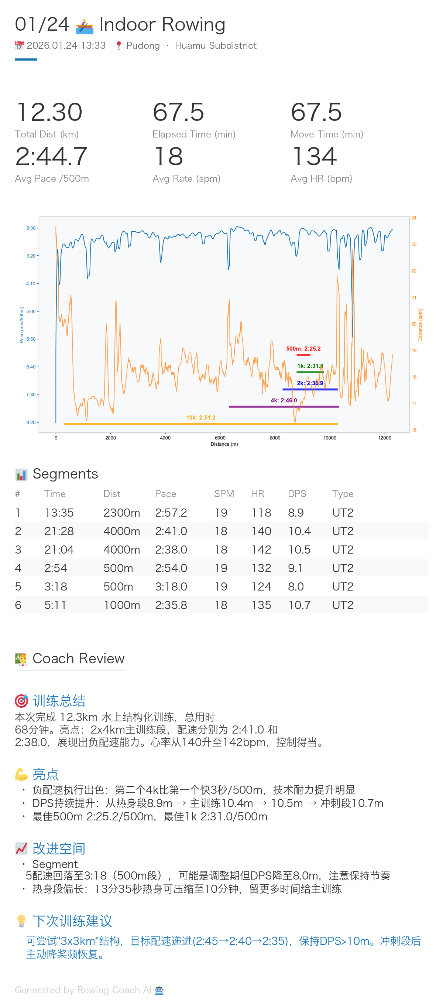

# Rowing Coach Skill 🚣‍♀️

Professional rowing coach assistant that analyzes FIT files and generates detailed training reports.

## Features

- **Multi-Source Support**: Compatible with FIT files from SpdCoach (on-water), Garmin, and Concept2 (indoor ERG).
- **Adaptive Segmentation**: Uses HR Valley detection with multi-layered fallbacks (Ruptures CPD, time-based) to accurately split training sessions into meaningful segments.
- **Deep Technical Analysis**:
    - **DPS (Distance Per Stroke)**: Evaluates technical efficiency against professional benchmarks.
    - **Pacing Strategy**: Identifies patterns like "Negative Splits" and power consistency.
    - **Zone Classification**: Automatically classifies training intensity (UT2, UT1, AT, TR, AN) based on Heart Rate Reserve (HRR) and stroke rate.
- **Coach Review**: Generates professional, actionable insights and technical recommendations in English.
- **Visualization**: Automatically generates Pace & Cadence charts for visual review.

## Project Structure

```text
rowing-coach/
├── SKILL.md                # Skill definition for LLM
├── README.md               # This file
├── scripts/
│   └── parse_fit.py        # Core FIT parsing and analysis logic
├── references/
│   ├── coach_guidelines.md # Professional rowing coaching criteria
│   └── training_log_style.md # Markdown report template and style
└── .venv/                  # Python virtual environment (optional)
```

## Quick Start

### Installation

Requires Python 3.8+ and the following libraries:
- `fitparse`
- `matplotlib`
- `pandas`
- `numpy`
- `ruptures`
- `geopy` (optional, for location data)
- `Pillow` (optional, for share images)
- `pilmoji` (optional, for emoji rendering)

```bash
pip install fitparse matplotlib pandas numpy ruptures geopy Pillow pilmoji
```

## Usage in Antigravity Assistant

This skill is designed to work seamlessly with the **Antigravity** agentic assistant. It leverages task management and professional coaching guidelines to provide a comprehensive training review.

### Automatic 6-Step Workflow
Simply drag and drop your `.fit` file into the Antigravity chat and ask for an analysis:

> **User**: "Analyze this rowing FIT file."

Antigravity will automatically:
1. **Parse FIT file** → Extract data and generate `ROW_*.json` or `ERG_*.json`
2. **Generate coach review** → Read JSON and apply `coach_guidelines.md` criteria
3. **Update report** → Replace placeholder with professional English feedback
4. **Regenerate share image** → Create `*_SHARE.png` with embedded review
5. **Generate social post** → Append Xiaohongshu-ready Chinese social media content
6. **Cleanup** → Remove temporary artifacts

### Output Files
- `ROW_*.md` or `ERG_*.md` - Complete training report with coach review
- `*_SHARE.png` - Social media share image

## Technical CLI Usage (Advanced)
For developers or offline processing:

```bash
# Basic analysis
python3 scripts/parse_fit.py "path/to/session.fit"

# Analysis with custom HR settings
python3 scripts/parse_fit.py "session.fit" --max-hr 195 --resting-hr 60
```

## Example Analysis (Jan 23rd On-Water Session)

### Input
File: `SpdCoach 2763073 20260123 0811AM.fit`

### Analysis Results (Full Segments)
| # | Time | Distance | Pace/500m | SPM | HR | DPS | Note |
| :--- | :--- | :--- | :--- | :--- | :--- | :--- | :--- |
| 1 | 10:11 | 1479m | 3:26.4 | 18 | 104 | 8.1m | UT2 |
| 2 | 4:26 | 693m | 3:11.6 | 17 | 118 | 9.2m | UT2 |
| 3 | 24:39 | 4331m | 2:50.7 | 16 | 132 | 11.0m | UT2 |
| 4 | 18:14 | 3280m | 2:46.7 | 17 | 136 | 10.6m | UT2 |
| 5 | 8:39 | 1330m | 3:14.9 | 16 | 116 | 9.6m | UT2 |
| 6 | 1:03 | 110m | 4:43.8 | 19 | 101 | 5.6m | Rest |
| 7 | 5:07 | 913m | 2:48.1 | 17 | 122 | 10.5m | UT2 |
| 8 | 2:37 | 369m | 3:32.3 | 23 | 107 | 6.1m | UT2 |
| 9 | 0:55 | 154m | 2:58.2 | 15 | 117 | 11.2m | UT2 |

### Coach Review (AI Generated)

#### 🎯 Training Summary
Total distance: **12.66km**, Duration: **75 mins**.
This was a classic **Low Rate Technical Endurance** session.
The stroke rate was maintained very low (**16-18spm**) throughout, with heart rate in a solid aerobic zone (avg 126bpm). The main goal was to find boat run and water feel at low intensity over long distance.

#### 🌟 Highlights
*   **Patience**: In the long segments (3 & 4), you maintained a steady 16-17spm without rushing the rate. This is the mental foundation of good technique.
*   **DPS Improvement**: During warm-up, DPS was only 8.1m, but in the main block (Seg 3) it improved to **11.0m**. This shows that as you warmed up, your power application improved significantly, and each stroke became "deeper".
*   **Heart Rate Control**: Most time spent in UT2 or recovery zone, perfect for recovery or pure technical work after heavy load.

#### 🚀 Improvements
*   **Warm-up Efficiency**: Seg 1 & 2 had DPS below 9m. Even when just starting, focus on the quality of the "catch" and avoid "empty strokes".
*   **Speed Variance**: Seg 3 & 4 had similar rates but pace varied (2:50 vs 2:46). Likely wind/water conditions, but aim for "consistent speed against wind, controlled rate with wind".

#### 💡 Next Session Advice
*   **Focus from Stroke 1**: Try to focus on **Catch** and **Connection** from the very first stroke. Aim for 10m+ DPS even during warm-up.
*   **Seek Consistency**: At low rates, feel the "Run" of the boat after the finish. Make the force curve of every stroke full and complete.

### Share Image
The skill also generates a social media share image with all metrics and coach review embedded:



## License
MIT
